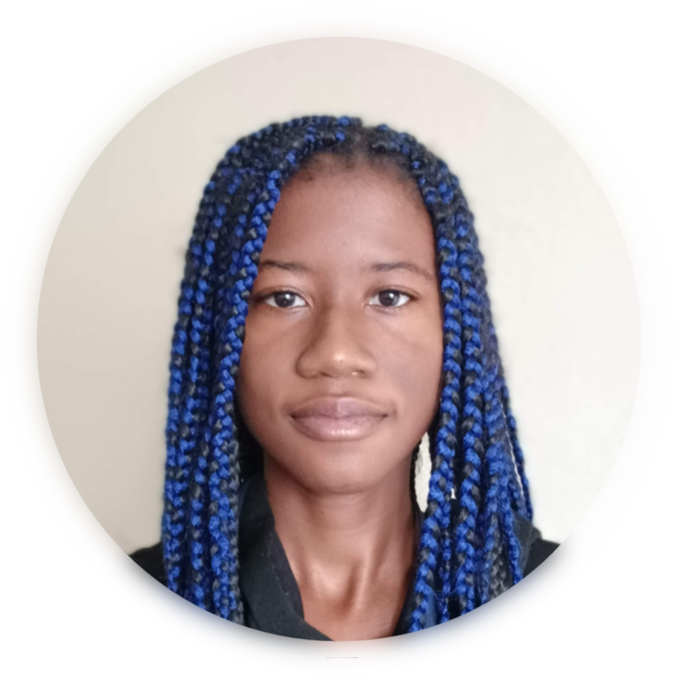
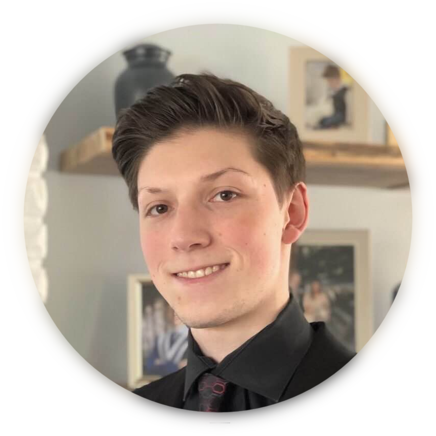

```insta-toc
---
title:
  name: Table of Contents
  level: 1
  center: false
exclude: ""
style:
  listType: dash
omit: []
levels:
  min: 1
  max: 6
---

# Table of Contents

- Alannis Davis
    - Role
    - Responsibilities
    - Experience
- Constantine Pallas
    - Role
    - Responsibilities
    - Role
    - Responsibilities
    - Experience
- Gavin Cole
    - Role
    - Responsibilities
    - Experience
    - Role
        - Responsibilities
    - Experience
    - Role
    - Responsibilities
    - Experience
- Oscar Espinola
    - Role
    - Responsibilities
    - Experience
- Rylan Dressler
    - Role
    - Responsibilities
    - Experience
```
# Alannis Davis
#Venture_Creation #Stellar_Octopians
<div align="left"> 
	<br>
	
</div>

## Role
Gameplay Programmer
## Responsibilities
Responsible for developing and refining the game's core mechanics and interactions.
## Experience 
She has 5 years of experience working in Unity and Visual Studio.  She is excited to create fun and enjoyable experiences that are memorable.
- C#/C++
- Unity Engine
- Unreal Engine
<div style="page-break-after: always"></div>
# Constantine Pallas
#Venture_Creation #Stellar_Octopians
<div align="left"> 
	<br>
	
</div>

## Role
Game Director, Lead Composer and Graphics Designer
## Responsibilities
Spearheading development of Daybreak, while also creating unique graphics solutions for the game's visual style and composing music and audio.
## Experience
* C#/C++
- Unity Engine
- Unreal Engine
<div style="page-break-after: always"></div>
# Daniel Fiuk
#Venture_Creation #Stellar_Octopians
<div align="left"> 
	<br>
	
</div>

## Role
Games Systems and Procedural Generation Programmer, Flex
## Responsibilities
Creating a consistent, stable, and efficient procedural level generator. Additionally will fill in where the team requires support. 
## Experience
Has 2 years of experience working with procedural level generation. Additionally has a breadth of knowledge and experience across game development, enabling him to be flexible and adaptable to the team's needs and goals.
- C#/C++
- Unity Engine
- Unreal Engine
<div style="page-break-after: always"></div>
# Gavin Cole
#Stellar_Octopians
<div align="left"> 
	<br>
	
</div>

## Role
UI Programmer
## Responsibilities
(1 - 2 Sentences, describing your responsibilities.)
## Experience
(2 - 3 items in a list detailing your experience. Can be software, past projects, etc.)
<div style="page-break-after: always"></div>

# Lilian Anderson
#Stellar_Octopians
<div align="left"> 
	<br>
	
</div>

## Role
3D Modeling and Texture Artist
### Responsibilities
(1 - 2 Sentences, describing your responsibilities.)
## Experience
(2 - 3 items in a list detailing your experience. Can be software, past projects, etc.)
<div style="page-break-after: always"></div>
# Mason Desjarlais
#Venture_Creation #Stellar_Octopians
<div align="left"> 
	<br>
	
</div>

## Role
Narrative Writer
## Responsibilities
Lead the drafting and implementation of a cohesive storyline for the game's narrative.
## Experience
Has prior experience in the field of games writing, for indie games specifically. He is eager to broaden his skill set through crafting intricate narratives to increase player immersion and enjoyment, and accumulate further experience through a published game.
- Unity Engine
- Unreal Engine
<div style="page-break-after: always"></div>
<div style="page-break-after: always"></div>
# Oscar Espinola
#Venture_Creation
<div align="left"> 
	<br>
	
</div>

## Role
2D Artist
## Responsibilities
Responsible for creating various sprites, graphics, animations, and character designs for the game.
## Experience
He has experience in both 2D and 3D artwork as well as creating concept art for several previous indie games. He is excited to expand his technical skills and create effective designs towards the game that fit the world, as well as gain experience creating a more established published title.
- Blender
- MediBang Paint
- Krita
- Aseprite
<div style="page-break-after: always"></div>
# Rylan Dressler
#Venture_Creation #Stellar_Octopians
<div align="left"> 
	<br>
	
</div>

## Role
VFX Artist
## Responsibilities
Will be designing and executing a variety of creation techniques to develop and implement VFX and other particles.
## Experience
Has experience designing and implementing various Visual Effects through the use of software including Unity's VFX and Shader Graphs to Unreal and Blender. 
- Unity VFX/Shader Graph
- Unreal Nigra